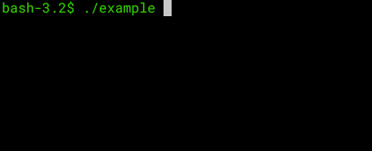
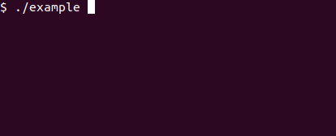

# Spinner

A simple, configurable, multi-platform terminal spinner. 

[](https://github.com/leaanthony/spinner/blob/master/LICENSE)
[](https://github.com/leaanthony/spinner)
[](https://goreportcard.com/report/github.com/leaanthony/spinner)
[](http://godoc.org/github.com/leaanthony/spinner)
[](https://github.com/leaanthony/spinner/issues)
## Demo


Spinner running on a Mac. See the [Linux](#linux-demo) and [Windows](#windows-demo) demos.

## About

Spinner is for giving the user visual feedback during processing in command line apps. It has the following features:

  * Works cross-platform
  * Completely customisable (messages, symbols, spinners)
  * Sensible defaults for non-VT100 systems
  * Smoooothe! (no ghost cursors, minimal text updates)
  * Minimal memory allocation (Reusable spinner)
  * Graceful handling of Ctrl-C interrupts

Tested on:

  * Windows 10
  * MacOS 10.13.5
  * Ubuntu 18.04 LTS

## Installation

```
go get -u github.com/leaanthony/spinner
```

## Usage

### New Spinner

Spinners are created using New(optionalMessage string), which takes an optional message to display.

```
  myspinner := spinner.New("Processing images")
```
or
```
  myspinner := spinner.New()
```

### Starting the spinner

To start the spinner, simply call Start(optionalMessage string). If the optional message is passed, it will be used as the spinner message.

```
  myspinner := spinner.New("Processing images")
  myspinner.Start()
```
is equivalent to
```
  myspinner := spinner.New()
  myspinner.Start("Processing images")
```
It's possible to reuse an existing spinner by calling Start() on a spinner that has been previously stopped with Error() or Success(). 

## Updating the spinner message

The spinner message can be updated with UpdateMessage(string) whilst running. 

```
  myspinner := spinner.New()
  myspinner.Start("Processing images")
  time.Sleep(time.Second * 2)
  myspinner.UpdateMessage("Adding funny text")
  time.Sleep(time.Second * 2)
  myspinner.Success("Your memes are ready")
```

### Stop with Success 

To stop the spinner and indicate successful completion, call the Success(optionalMessage string) method. This will print a success symbol with the original message - all in green. If the optional string is given, it will be used instead of the original message.

```
  // Default
  myspinner := spinner.New("Processing images")
  myspinner.Start()
  time.Sleep(time.Second * 2)
  myspinner.Success()

  // Custom Message
  myspinner := spinner.New("Processing audio")
  myspinner.Start()
  time.Sleep(time.Second * 2)
  myspinner.Success("It took a while, but that was successful!")
```

### Stop with Error 

To stop the spinner and indicate an error, call the Error(optionalMessage string) method.
This has the same functionality as Success(), but will print an error symbol and it will all be in red.

```
  // Default
  myspinner := spinner.New("Processing images")
  myspinner.Start()
  time.Sleep(time.Second * 2)
  myspinner.Error()

  // Custom message
  myspinner := spinner.New("Processing audio")
  myspinner.Start()
  time.Sleep(time.Second * 2)
  myspinner.Error("Too many lolcats!")
```

### Success/Error using custom formatter

In addition to Success() and Error(), there is Successf() and Errorf(). Both take the same parameters: (format string, args ...interface{}). This is identical to fmt.Sprintf (which it uses under the hood). 

```
  // Formatted Success
  a = spinner.New("This is a formatted custom success message")
  a.Start()
  time.Sleep(time.Second * 2)
  spin := "Spinner"
  awesome := "Awesome"
  a.Successf("%s is %s!", spin, awesome)

  // Formatted Error
  a = spinner.New("This is a formatted custom error message")
  a.Start()
  secs := 2
  time.Sleep(time.Second * time.Duration(secs))
  a.Errorf("I waited %d seconds to error!", secs)
```

### Custom Success/Error Symbols

Both Success() and Error() use symbols (as well as colour) to indicate their status.
These symbols default to spaces on Windows and ✓ & ✗ on other (vt100 compatible) platforms. They can be set manually using the SetSuccessSymbol(symbol string) and SetErrorSymbol(symbol string) methods.

```
  myspinner := spinner.New("Processing images")

  // Custom symbols
  myspinner.SetErrorSymbol("💩")
  myspinner.SetSuccessSymbol("🏆")

  myspinner.Start()
  time.Sleep(time.Second * 2)
  myspinner.Error("It broke :(")
```

### Custom Spinner

By default, the spinner used is the spinning bar animation on Windows and the snake animation for other platforms. This can be customised using SetSpinFrames(frames []string). It takes a slice of strings defining the spinner symbols. 

```
  myspinner := spinner.New("Processing images")
  myspinner.SetSpinFrames([]string{"^", ">", "v", "<"})
  myspinner.Start()
  time.Sleep(time.Second * 2)
  myspinner.Success()
```

### Resuse Spinner

It's possible to reuse an existing spinner by calling the Restart(message string) method. This restarts the spinner with the given message.

```
  myspinner := spinner.New("Processing images")
  myspinner.SetSpinFrames([]string{"^", ">", "v", "<"})
  myspinner.Start()
  time.Sleep(time.Second * 2)
  myspinner.Success()

  myspinner.Restart("Spinner reuse!")
  time.Sleep(time.Second * 2)
  myspinner.Success()
```

## Handling Ctrl-C Interrupts

By default, Ctrl-C will error out the current spinner with the message "Aborted (ctrl-c)". A custom message can be set using SetAbortMessage(string).

```
	myspinner := spinner.New("💣 Tick...tick...tick...")
	myspinner.SetAbortMessage("Defused!")
	myspinner.Start()
	time.Sleep(time.Second * 5)
	myspinner.Success("💥 Boom!")
```

## Rationale

I tried to find a simple, true cross platform spinner for Go that did what I wanted and couldn't find one. I'm sure they exist, but this was fun.

## Linux Demo


## Windows Demo


## With a little help from my friends

This project uses the awesome [Color] library. The code for handling windows cursor hiding and showing was split off into a different project ([wincursor])

[Color]: https://github.com/fatih/color
[wincursor]: https://github.com/leaanthony/wincursor

---
[](https://github.com/leaanthony/spinner/graphs/commit-activity)
[](http://hits.dwyl.io/leaanthony/spinner)
